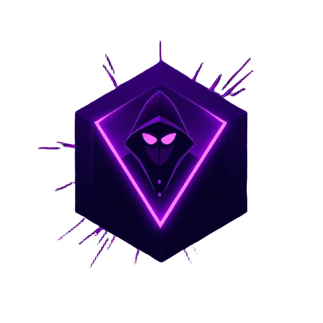

<p align="center">
    
</p>
<h3 align="center" style="font-family: 'Fira Mono', Monospace;">agentwatch</h3>
<h3 align="center" style="font-family: 'Fira Mono', Monospace;">Platform-Agnostic Agentic AI Runtime Observability Framework</h3>

<p align="center">
    <a href="https://github.com/cyberark/agentwatch/commits/main">
        
    </a>
    <a href="https://github.com/cyberark/agentwatch">
        
    </a>
    <a href="https://github.com/cyberark/agentwatch/blob/main/LICENSE">
        
    </a>
    <a href="https://discord.gg/Zt297RAK">
        
    </a>
</p>

## 🌟 Overview

agentwatch is a cutting-edge observability framework designed to provide deep insights into AI agent interactions across diverse platforms and frameworks. By seamlessly intercepting, logging, and analyzing interactions, agentwatch empowers developers to understand and optimize their AI-driven applications with unprecedented visibility.

<p align="center">
    
</p>

## ✨ Key Features

- **Comprehensive Interaction Tracking**: Monitor LLM and tool calls in real-time
- **Advanced Visualization**: Generate intuitive graphs for in-depth analysis
- **Detailed Metadata Capture**: Log tool inputs, arguments, and performance metrics
- **Multi-Framework Support**: Compatible with various AI development frameworks

## 🚀 Supported Frameworks

- Langgraph
- Autogen
- ...
- Any other* framework or library which uses an LLM :D

We're working on updating our models to match the various providers - stay tuned!

## 📦 Prerequisites
To ensure compatibility with agentwatch, your application must be written in Python. The visualization UI will be built locally on your endpoint using npm,
so make sure you have the following installed:

- Python 3.11+
- npm

## 🔧 Installation

Install agentwatch directly from GitHub:

```bash
pip install git+https://github.com/cyberark/agentwatch.git
```

## 🖥️ Quick Start

1. Import agentwatch in your main module:
   ```python
   import agentwatch
   ```

2. Ensure your entry point is within a `__main__` block:
   ```python
   if __name__ == "__main__":
       # Your code execution starts here
   ```

3. Launch the UI:
   ```bash
   agentwatch ui
   # (Take note this will open a new tab in your browser)
   ```

Run your main module - and AI agent interactions will now be automatically tracked and monitored in the UI!

## 📌 Examples
We've included a few examples under the [examples/](https://github.com/cyberark/agentwatch/tree/main/examples) folder.
To use the examples, clone this repository, and follow these steps:

1. Install python dependencies using poetry. If you don't have Poetry installed, get it [here](https://python-poetry.org/)
   ```bash
   poetry install --with dev
   ```

2. Run the UI
   ```bash
   ./run_ui.sh
   ```

3. Run one of the examples under examples/. Don't forget to set the necessary API keys in the [.env](https://pypi.org/project/python-dotenv/) file
   ```bash
   poetry run python examples/langgraph_example.py
   ```

## 📚 Documentation

For comprehensive guides and detailed usage instructions, visit our [GitHub Wiki](https://github.com/cyberark/agentwatch/wiki).

## 🤝 Contributing

We welcome contributions! Please review our [CONTRIBUTING.md](https://github.com/cyberark/agentwatch/blob/main/CONTRIBUTING.md) for guidelines on how to get involved.

## 📄 License

agentwatch is released under the [Apache License 2.0](https://www.apache.org/licenses/LICENSE-2.0).

## 📧 Contact

Have questions or suggestions? Reach out to us through LinkedIn: [Shai Dvash](https://www.linkedin.com/in/shaidv/) or join our [Discord Community](https://discord.gg/Zt297RAK).

## 🌈 Powered By CyberArk

A project from CyberArk, dedicated to advancing AI observability and security.
